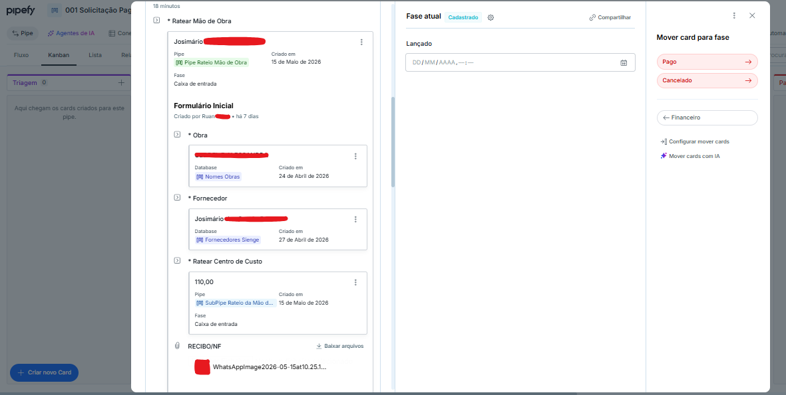
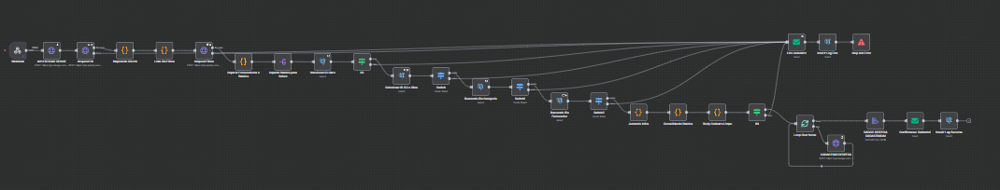
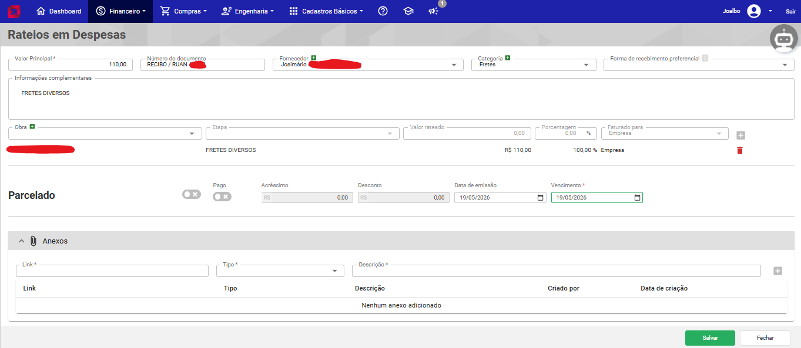
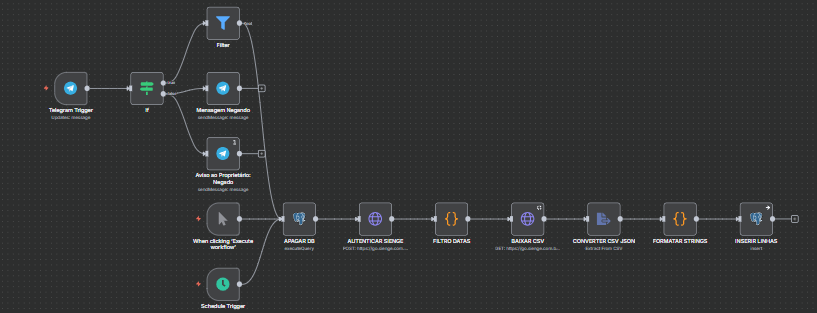
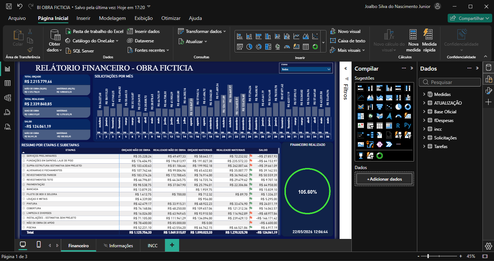
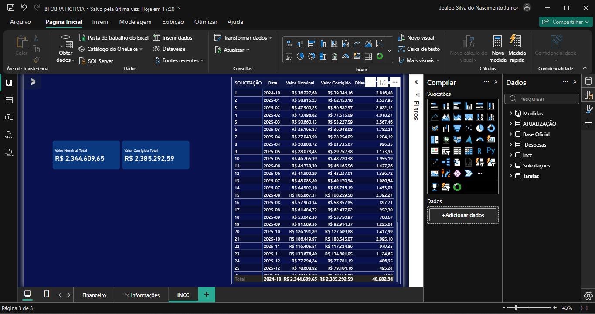

# Sistema de Gestão de Despesas de Obras — Pipefy · n8n · Sienge · Power BI

## Visão Geral

Este repositório documenta um ecossistema completo de automação e Business Intelligence aplicado à gestão financeira de obras de construção civil (Produção real). O sistema resolve dois problemas centrais:

1. **Cadastro repetitivo e sem controle**: a equipe de compras comunicava despesas ao financeiro por e-mail e planilhas. O financeiro digitava manualmente no Sienge ERP. Sem rastreabilidade, sem padrão, com risco de erros manuais.
2. **Falta de visibilidade gerencial**: não havia um painel consolidado que cruzasse o realizado no ERP com o orçamento e com a variação de custos da construção civil (INCC).

A solução é composta por três camadas:

| Camada | Componente | Função |
|---|---|---|
| **Entrada controlada** | Pipefy | Formulário governado de solicitação de compras com fluxo de aprovação |
| **Automação** | n8n (2 workflows) + Python | Cadastro automático de despesas no ERP e sincronização do banco de dados |
| **Visualização** | Power BI | Dashboard gerencial de Realizado vs. Orçado e análise de valorização pelo INCC |

---

## Estrutura do Repositório

```
.
├── N8N/
│   ├── CADASTRO AUTOMÁTICO.json          # Workflow: Pipefy → Sienge (cadastro de despesas)
│   └── PIPELINE SIENGE X POSTGRE.json    # Workflow: Sienge → PostgreSQL (sincronização do BI)
│
├── BI/
│   ├── BI OBRA FICTICIA.pbit             # Template Power BI (dados fictícios)
│   └── PLANILHA ORCAMENTO FICTICIA.xlsx  # Planilha de orçamento que alimenta o BI
│
├── WebScraping/
│   └── scrapincc.py                      # Script Python: coleta INCC mensal do portal FGV
│
├── visual_workflow_cadastro.png    # Screenshot do workflow n8n de cadastro
├── visual_workflow_etl.png         # Screenshot do workflow ETL Sienge -> Postgre -> PowerBI
├── visual_pbi1.png                 # Screenshot do BI — Realizado vs. Orçado // Resumo Obra
├── visual_pbi2.png                 # Screenshot do BI — Valorização pelo INCC
├── visual_pipefy.png               # Screenshot do BPM Pipefy
├── visual_sienge.png               # Screenshot do ERP Sienge
                       
└── README.md
```

---

## Arquitetura Geral

```
┌──────────────────────────────────────────────────────────────────────────────┐
│                          FLUXO DE ENTRADA (Pipefy)                           │
│  Solicitação de Compra → Aprovação → Fase "Cadastrado" → HTTP POST → n8n    │
└──────────────────────────────────────┬───────────────────────────────────────┘
                                       │
                    ┌──────────────────▼──────────────────┐
                    │   WORKFLOW 1: Cadastro Automático    │
                    │   Pipefy (GraphQL) → Sienge (REST)   │
                    │   + Lookup de IDs no PostgreSQL      │
                    │   + Log de auditoria                 │
                    └──────────────────┬──────────────────┘
                                       │ Despesa criada no Sienge ERP
                                       │
┌──────────────────────────────────────▼───────────────────────────────────────┐
│                              SIENGE ERP                                      │
│              Base de dados financeira das obras                              │
└──────────────────────────────────────┬───────────────────────────────────────┘
                                       │
                    ┌──────────────────▼──────────────────┐
                    │   WORKFLOW 2: Pipeline Sienge → DB   │
                    │   Gatilhos: Schedule / Telegram / Manual │
                    │   Sienge CSV API → PostgreSQL        │
                    └──────────────────┬──────────────────┘
                                       │
┌──────────────────────────────────────▼───────────────────────────────────────┐
│                           POSTGRESQL (Data Store)                            │
│   siengecsv: despesas realizadas  │  siengeccs / fornecedores / categorias  │
└──────────────────────────────────────┬───────────────────────────────────────┘
                                       │
               ┌───────────────────────┴────────────────────────┐
               │                                                │
   ┌───────────▼───────────┐                      ┌────────────▼────────────┐
   │  PLANILHA ORÇAMENTO   │                      │   INCC MENSAL (Excel)   │
   │  (fonte do orçado)    │                      │   atualizado por Python │
   └───────────┬───────────┘                      └────────────┬────────────┘
               │                                               │ Web scraping FGV
               └───────────────────────┬────────────────────────┘
                                       │
                    ┌──────────────────▼──────────────────┐
                    │         POWER BI DASHBOARD           │
                    │  Página 1: Realizado vs. Orçado      │
                    │  Página 2: Valorização pelo INCC     │
                    └─────────────────────────────────────┘
```

---

## Parte 1 — Workflow: Cadastro Automático de Despesas

**Arquivo:** `N8N/CADASTRO AUTOMÁTICO.json`

### O Problema Resolvido

| Antes | Depois |
|---|---|
| Compras enviava Excel por e-mail para o Financeiro | Compras preenche card estruturado no Pipefy |
| Financeiro digitava manualmente no Sienge | n8n registra automaticamente após a aprovação |
| Não era possível dar acesso ao Sienge para Compras sem perder controle | Pipefy é a camada de entrada; só a automação escreve no ERP |
| Sem trilha de auditoria | Cada execução é registrada no PostgreSQL com status, card ID e ID da despesa |

### Screenshots

**Card no Pipefy — fase "Cadastrado" (gatilho da automação)**



**Workflow n8n — Cadastro Automático**



**Resultado no Sienge ERP — despesa cadastrada automaticamente**



### Fluxo de Dados

#### Fase 1 — Gatilho e Autenticação

| # | Nó | Tipo | Descrição |
|---|----|----|-------------|
| 1 | `Webhook` | Webhook | Recebe POST do Pipefy quando o card chega à fase "Cadastrado". Payload: ID do card principal e lista de IDs de cards filhos (fornecedores) separados por vírgula. |
| 2 | `AUTENTICAR SIENGE` | HTTP Request | Obtém Bearer token via OAuth2 password grant no Sienge. Executado uma única vez por rodada do workflow. |

#### Fase 2 — Extração de Dados do Pipefy (GraphQL)

| # | Nó | Tipo | Descrição |
|---|----|----|-------------|
| 3 | `Request Pai` | HTTP Request | Query GraphQL para o card principal: data de vencimento, nome do documento, para quem foi faturado (`faturado_para`) e nome da obra. Com retry automático (3×, 5 s). |
| 4 | `Mapeando IDs Pai` | Code (JS) | Transforma o array `fields[]` do Pipefy em dicionário `{ id_campo → valor }` para acesso direto nas etapas seguintes. |
| 5 | `Lista IDs Filhos` | Code (JS) | Faz parse da string de IDs separados por vírgula, gerando um item n8n por fornecedor para processamento paralelo. |
| 6 | `Request Filhos` | HTTP Request | Query GraphQL por card de fornecedor. Busca relações: **Fornecedor** (nome/ID) e **Ratear Centro de Custo** (CC, valor, categoria, descrição). Com retry automático. |
| 7 | `Separar Fornecedores e Rateios` | Code (JS) | Normaliza a resposta GraphQL aninhada em objetos planos por linha de rateio. Atribui ID composto único por fornecedor para suportar deduplicação. |

#### Fase 3 — Resolução de IDs via PostgreSQL

O workflow traduz nomes (como gravados no Pipefy) para IDs numéricos exigidos pelo Sienge. Cada lookup é protegido por um gate de validação que desvia para o caminho de erro em caso de resultado nulo.

| # | Nó | Tipo | Descrição |
|---|----|----|-------------|
| 8 | `Separar Rateios para Select` | Split Out | Explode o array de rateios em itens individuais para o pipeline de lookup. |
| 9 | `Selecionar ID Obra` | Postgres | Busca ID da obra em `siengeccs` pelo nome (normalizado com `.toUpperCase()`). |
| 10 | `If3` | If | Gate: continua se ID da obra foi encontrado **ou** se é "ADMINISTRATIVO 26" (sem CC no Sienge). Caso contrário, desvia para erro. |
| 11 | `Selecionar ID CC e Obra` | Postgres | Busca `idobra` e `idcc` em `siengeccs`, filtrando por nome da obra e nome do CC. |
| 12 | `Switch` | Switch | Valida `idobra` não nulo. |
| 13 | `Buscando IDs Categoria` | Postgres | Busca ID fixo da categoria "Mão de Obra" em `siengecategorias`. |
| 14 | `Switch1` | Switch | Valida `idcategoria` não nulo. |
| 15 | `Buscando IDs Fornecedor` | Postgres | Busca `idfornecedor` em `siengefornecedores` pelo nome vindo do Pipefy. |
| 16 | `Switch2` | Switch | Valida `idfornecedor` não nulo. |

#### Fase 4 — Transformação e Montagem do Payload

| # | Nó | Tipo | Descrição |
|---|----|----|-------------|
| 17 | `Juntando Infos` | Code (JS) | Une dados de quatro fontes em registro único por rateio: campos Pipefy, IDs Postgres, ID categoria, ID fornecedor. Usa `itemMatching(i)` para correlacionar ramificações paralelas por índice. |
| 18 | `Consolidando Rateios` | Code (JS) | Agrupa rateios por card de fornecedor (uma NF por fornecedor). Soma valores (BR → float), concatena descrições com ` // `, formata data para ISO 8601. Deduplicação via `Set` de IDs processados. |
| 19 | `Body Cadastro Limpo` | Code (JS) | Monta payload final para o Sienge. Consolida rateios com mesma combinação obra+CC; aplica `isCustomerCharged: true` quando `faturado_para === "Cliente"`; define `costEstimateGroup: null` para obras administrativas; limita descrição a 300 caracteres. |

#### Fase 5 — Cadastro e Observabilidade

| # | Nó | Tipo | Descrição |
|---|----|----|-------------|
| 20 | `If4` | If | Guarda final: payload não nulo antes de chamar a API. |
| 21 | `Loop Over Items` | Split in Batches | Processa uma NF por vez — falha em uma não bloqueia as demais. |
| 22 | `CADASTRAR DESPESA` | HTTP Request | `POST /api/v1/financial/company/1492/debit/` com Bearer token da etapa 2. |
| 23 | `DADOS DESPESA CADASTRADA1` | Extract from File | Converte resposta binária da API de volta para JSON. |
| 24 | `Confirmacao Cadastro1` | Send Email | E-mail de confirmação com ID, vencimento, fornecedor, obra e documento. |
| 25 | `Inserir Log Success` | Postgres | Grava `success` em `logspipefy` com ID do card Pipefy e ID da despesa criada. |

#### Caminho de Erro

| Nó | Ação |
|---|---|
| `Erro cadastro1` | E-mail de alerta com ID do card e timestamp |
| `Inserir Log Erro` | Grava `error` em `logspipefy` (id_sienge = 0) |
| `Stop and Error` | Encerra execução para evitar cadastros parciais ou duplicados |

### Payload de Entrada (Pipefy → n8n)

```json
{
  "id_cardprincipal": "1352347205",
  "id_fornecedorreembolso": "1352358301, 1352360706, 1352365511"
}
```

### Payload de Saída (n8n → Sienge API)

```json
{
  "category": { "id": 42 },
  "company": { "id": 1492, "name": "FAG ENGENHARIA EIRELI" },
  "partner": { "id": 1234, "name": "FORNECEDOR LTDA" },
  "description": "ESTRUTURA, ALVENARIA",
  "documentNumber": "NF-001",
  "value": 5000.00,
  "grossValue": 5000.00,
  "emissionDate": "2025-05-22",
  "transactionRecordList": [
    {
      "forecast": true,
      "sign": -1,
      "dueDate": "2025-06-10",
      "value": 5000.00,
      "grossValue": 5000.00,
      "transactionRecordBuildings": [
        {
          "building": { "id": 7, "name": "OBRA EXEMPLO", "code": null },
          "costEstimateGroup": { "id": 12, "name": "ESTRUTURA" },
          "value": 5000.00,
          "grossValue": 5000.00,
          "amountPerBuilding": 5000.00,
          "isCustomerCharged": false,
          "increase": 0,
          "discount": 0
        }
      ]
    }
  ]
}
```

### Decisões de Projeto

**Gates de validação encadeados**
Cada lookup no PostgreSQL é seguido por um `Switch` ou `If`. ID não encontrado → execução desviada para o erro imediatamente, sem chamar a API com payload inválido.

**Deduplicação via `Set`**
O n8n expande itens em ramificações paralelas; o mesmo ID de rateio pode chegar mais de uma vez ao nó de consolidação. Um `Set` de `processedRateioIds` evita dupla contagem de valores.

**Caso especial administrativo**
Obras "ADMINISTRATIVO 26" não têm estrutura de CC no Sienge. O workflow detecta e define `costEstimateGroup: null` mantendo o restante do payload válido.

**`isCustomerCharged`**
Quando `faturado_para === "Cliente"`, a despesa é marcada como repassável ao cliente, viabilizando fluxo de cobrança posterior no ERP.

---

## Parte 2 — Workflow: Pipeline Sienge → PostgreSQL

**Arquivo:** `N8N/PIPELINE SIENGE X POSTGRE.json`

Este workflow é responsável por manter o banco de dados do Power BI atualizado com as despesas registradas no Sienge. Funciona como um processo de **full refresh**: trunca a tabela e recarrega todos os dados do período configurado.



### Gatilhos (três formas de disparar)

| Gatilho | Descrição |
|---|---|
| **Schedule Trigger** | Execução automática em intervalo configurável (ex.: diário) |
| **Manual** | Botão "Execute workflow" dentro do n8n para reprocessamento pontual |
| **Telegram Bot** | Comando `/atualizarcsv` enviado ao bot. Inclui autenticação por whitelist de Telegram user IDs — apenas usuários autorizados executam. Tentativas não autorizadas geram notificação ao proprietário. |

### Fluxo de Dados

| # | Nó | Tipo | Descrição |
|---|----|----|-------------|
| 1 | `APAGAR DB` | Postgres | `TRUNCATE TABLE siengecsv` — limpa todos os registros antes de recarregar. |
| 2 | `AUTENTICAR SIENGE` | HTTP Request | OAuth2 password grant para obter Bearer token. |
| 3 | `FILTRO DATAS` | Code (JS) | Gera lista de períodos mensais entre junho/2024 e dezembro/2026 (`data_inicio` e `data_fim` por mês). Permite paginação da API do Sienge, que tem limite por período. |
| 4 | `BAIXAR CSV` | HTTP Request | `GET /api/v1/financial/debits` com parâmetros `dueDateFrom`, `dueDateTo`, `companyId` e `extension=csv`. Retorna arquivo binário por período. |
| 5 | `CONVERTER CSV JSON` | Extract from File | Converte o CSV (delimitador `;`) para array de objetos JSON. |
| 6 | `FORMATAR STRINGS` | Code (JS) | Normaliza campos de texto para maiúsculas (`building`, `category`, `costEstimateGroup`, `partner`, etc.) para consistência com as tabelas de referência. |
| 7 | `INSERIR LINHAS` | Postgres | Upsert na tabela `siengecsv` com todos os campos da despesa: parceiro, datas, valores, obra, categoria, CC, método de pagamento, etc. |

### Schema da Tabela `siengecsv`

```sql
CREATE TABLE siengecsv (
    id                       INTEGER PRIMARY KEY,
    transactionId            INTEGER,
    partner                  TEXT,
    emissionDate             DATE,
    dueDate                  DATE,
    paymentDate              DATE,
    grossValue               NUMERIC,
    value                    NUMERIC,
    installmentOrdinal       INTEGER,
    installmentsQuantity     INTEGER,
    forecast                 BOOLEAN,
    isCustomerCharged        BOOLEAN,
    isReplicableTransaction  BOOLEAN,
    walletFormattedName      TEXT,
    building                 TEXT,
    category                 TEXT,
    documentNumber           TEXT,
    costEstimateGroup        TEXT,
    description              TEXT,
    paymentMethod            TEXT
);
```

---

## Parte 3 — Web Scraping: INCC Mensal

**Arquivo:** `WebScraping/scrapincc.py`

Script Python que coleta automaticamente os valores mensais do **INCC-M** (Índice Nacional de Custo da Construção) publicados pelo portal da **FGV**, preenchendo uma planilha Excel histórica.

### Por que isso importa

O INCC é o principal índice de correção de contratos na construção civil. Cruzar o valor investido pelo cliente com a variação acumulada do INCC permite mostrar quanto aquele investimento se valorizou em termos do custo real da construção — a segunda página do Power BI.

### Como funciona

1. Lê uma planilha Excel (`INCC MENSAL.xlsx`) com coluna `data` (ex.: `jan/25`) e coluna `valor` (inicialmente vazia)
2. Para cada linha com `valor` vazio, constrói a URL do portal FGV:
   ```
   https://portal.fgv.br/noticias/incc-m-{mes}-{ano}
   ```
3. Faz requisição HTTP com adaptador TLS customizado (necessário por incompatibilidade de protocolo SSL do servidor da FGV)
4. Faz parsing do HTML com **BeautifulSoup**, localizando a tabela com os valores do índice
5. Extrai o valor correspondente ao período e atualiza a linha no DataFrame
6. Salva o resultado em um novo arquivo Excel (preservando o original)

### Execução

```bash
# Instalar dependências
pip install pandas requests beautifulsoup4 openpyxl

# Executar
python WebScraping/scrapincc.py
```

> Antes de executar, ajuste as variáveis `EXCEL_PATH_ORIGINAL` e `EXCEL_PATH_NOVO` no topo do script com os caminhos corretos para a sua planilha de INCC.

### Tecnologias

| Biblioteca | Uso |
|---|---|
| `requests` + `TLSAdapter` | Requisições HTTP com forçamento de TLSv1.2 para compatibilidade com o servidor da FGV |
| `BeautifulSoup` | Parsing do HTML da página de notícias da FGV |
| `pandas` | Leitura, manipulação e escrita da planilha Excel |

---

## Parte 4 — Dashboard Power BI

**Arquivo:** `BI/BI OBRA FICTICIA.pbit`  
**Fonte de orçamento:** `BI/PLANILHA ORCAMENTO FICTICIA.xlsx`

O Power BI conecta três fontes: a tabela `siengecsv` do PostgreSQL (despesas realizadas), a planilha de orçamento e a planilha de INCC, entregando visibilidade gerencial em duas páginas.

### Estrutura da Planilha de Orçamento

A planilha possui duas abas principais consumidas pelo Power BI:

**Aba `BASE APURAÇÃO`** — linha de cabeçalho com os valores consolidados e por etapa. As colunas mais importantes são:

| Coluna | Descrição |
|---|---|
| `GERAL ORÇADO MAO DE OBRA` | Total orçado de mão de obra para a obra inteira |
| `GERAL ORÇADO MATERIAIS` | Total orçado de materiais para a obra inteira |
| `GERAL REALIZADO MAO DE OBRA` | Total realizado de mão de obra (vindo do Sienge via PostgreSQL) |
| `GERAL REALIZADO MATERIAIS` | Total realizado de materiais |
| `{N} ORÇADO MAO` | Orçado de mão de obra por etapa (ex.: `1 ORÇADO MAO`, `2 ORÇADO MAO`, ...) |
| `{N} ORÇADO MAT` | Orçado de materiais por etapa |
| `{N} ORÇADO TOTAL` | Soma de mão de obra + materiais da etapa |
| `{N} REALIZADO MAO` | Realizado de mão de obra por etapa |
| `{N} REALIZADO MAT` | Realizado de materiais por etapa |
| `SOMA SOLICITAÇÕES` | Somatório das solicitações de pagamento registradas |

A obra fictícia possui **14 etapas** numeradas (incluindo subdivisões como `7.1` e `7.2`). Cada etapa tem seu próprio par de colunas `ORÇADO MAO` / `ORÇADO MAT`, que alimentam o comparativo Realizado vs. Orçado no dashboard.

**Aba `DADOS PAGAMENTOS`** — detalhamento de pagamentos com colunas `VALOR`, `MÊS`, `SOLICITAÇÃO`, `MAO DE OBRA` e `MATERIAL`, usadas para o resumo de gastos por solicitação na página 1 do BI.

### Página 1 — Realizado vs. Orçado



Análise dos centros de custo da obra com comparativo entre o que foi gasto e o que foi previsto no orçamento.

| Indicador | Descrição |
|---|---|
| **Realizado vs. Orçado por CC** | Comparativo visual por etapa/centro de custo da obra |
| **% do orçamento consumido** | Ex.: 105% indica que a etapa estourou 5% do orçamento |
| **Saldo disponível** | Quanto ainda resta do orçamento na obra geral e por etapa |
| **Resumo por solicitação** | Valor gasto por solicitação de compra com data da solicitação |

### Página 2 — Valorização pelo INCC



Responde à pergunta: *"O dinheiro que o cliente investiu nesta obra quanto valeria hoje, considerando a variação do custo da construção civil?"*

| Indicador | Descrição |
|---|---|
| **Valor investido acumulado** | Somatório cronológico dos desembolsos do cliente |
| **Variação INCC acumulada** | Índice acumulado desde o início da obra |
| **Valorização real** | Quanto o investimento se valorizou em termos do INCC |

---

## Tecnologias Utilizadas

| Tecnologia | Papel no Projeto |
|---|---|
| **n8n** | Orquestração dos dois workflows de automação |
| **Pipefy** | BPM — entrada estruturada e governada para compras |
| **Sienge ERP** | Sistema de destino para despesas e fonte de dados para o BI |
| **PostgreSQL** | Data store central: tabela de despesas + tabelas de referência + log de auditoria |
| **Power BI** | Dashboard gerencial de Realizado vs. Orçado e análise de INCC |
| **Python** | Web scraping do INCC-M no portal da FGV |
| **GraphQL** | Protocolo de extração de dados do Pipefy |
| **REST / OAuth2** | Protocolo da API do Sienge |
| **Telegram Bot** | Interface de comando para atualização manual do banco de dados |
| **SMTP** | Notificações transacionais de sucesso e falha no cadastro |

---

## Schema do Banco de Dados (PostgreSQL)

### Tabelas de Referência (lookup)

```sql
-- Obras e Centros de Custo do Sienge
CREATE TABLE siengeccs (
    idobra    INTEGER,
    nomeobra  TEXT,
    idcc      INTEGER,
    nomecc    TEXT
);

-- Categorias de despesa do Sienge
CREATE TABLE siengecategorias (
    idcategoria   INTEGER,
    nomecategoria TEXT
);

-- Fornecedores cadastrados no Sienge
CREATE TABLE siengefornecedores (
    idfornecedor   INTEGER,
    nomefornecedor TEXT
);
```

### Tabela de Log de Auditoria

```sql
CREATE TABLE logspipefy (
    id_card    INTEGER,
    id_sienge  INTEGER,
    atividade  TEXT,       -- 'success' | 'error'
    workflow   TEXT,       -- 'maodeobra'
    data_log   TIMESTAMP DEFAULT NOW()
);
```

### Consultas de Monitoramento

```sql
-- Últimas 50 execuções do workflow de cadastro
SELECT id_card, id_sienge, atividade, data_log
FROM logspipefy
WHERE workflow = 'maodeobra'
ORDER BY data_log DESC
LIMIT 50;

-- Taxa de erro nos últimos 30 dias
SELECT atividade, COUNT(*) AS total
FROM logspipefy
WHERE workflow = 'maodeobra'
  AND data_log >= NOW() - INTERVAL '30 days'
GROUP BY atividade;

-- Despesas realizadas por obra no mês atual
SELECT building, SUM(value) AS total_realizado
FROM siengecsv
WHERE DATE_TRUNC('month', dueDate) = DATE_TRUNC('month', CURRENT_DATE)
GROUP BY building
ORDER BY total_realizado DESC;
```

---

## Configuração e Deploy

### Pré-requisitos

- Instância n8n (self-hosted ou cloud)
- Pipe no Pipefy com fluxo de compras e automação na fase "Cadastrado"
- Conta Sienge com REST API e OAuth2 habilitados
- PostgreSQL com as tabelas populadas
- Servidor SMTP para notificações
- Bot no Telegram (para o gatilho do Pipeline)
- Python 3.x com `pandas`, `requests`, `beautifulsoup4` instalados

### Credenciais Necessárias no n8n

| Credencial | Tipo | Utilizada em |
|---|---|---|
| Token da API do Pipefy | HTTP Header Auth | `Request Pai`, `Request Filhos` |
| OAuth2 do Sienge | Campos no corpo da requisição | `AUTENTICAR SIENGE` (ambos os workflows) |
| Conexão PostgreSQL | Postgres | Todos os nós de banco de dados |
| SMTP | SMTP | `Confirmacao Cadastro1`, `Erro cadastro1` |
| Telegram Bot Token | Telegram API | `Telegram Trigger`, nós de resposta |

---

## Autor

**Joalbo Nascimento**  
Engenharia de Dados · Automação de Processos · Integração com ERP
